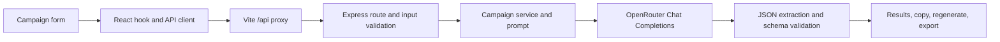

# CampaignAI Studio

<p align="center">
  
  
  
  
  
</p>

<div align="center">
  <h1><b>CampaignAI Studio</b></h1>
  <p>
    <b>AI-powered ecommerce campaign copy generator</b><br>
    Turn one brief into email, WhatsApp, and SMS content in seconds.
  </p>
</div>

<table>
  <tr>
    <td width="33%" bgcolor="#0f172a" valign="top">
      <h3>🚀 Core Idea</h3>
      <p>Generate conversion-focused campaign assets from a single campaign brief using AI and structured validation.</p>
    </td>
    <td width="33%" bgcolor="#111827" valign="top">
      <h3>📦 What it creates</h3>
      <p>5 email subjects, 3 preview texts, promotional email, WhatsApp message, and SMS in one workflow.</p>
    </td>
    <td width="33%" bgcolor="#0f172a" valign="top">
      <h3>✨ Bonus features</h3>
      <p>Tone control, section regeneration, instant copy actions, Markdown export, and PDF export.</p>
    </td>
  </tr>
</table>

## Overview

CampaignAI Studio is a full-stack marketing assistant that takes a product brief and produces high-converting campaign content tailored for multiple channels. The frontend captures campaign details, the backend validates and prepares the request, and an AI model generates structured outputs ready for direct use.

This repository includes the React client, Express API, prompt logic, validation, tests, and documentation needed to run and evaluate the project.

## Why this project stands out

- Smart campaign input system for product, offer, audience, objective, and tone
- AI-generated copy grounded in the provided product facts
- Multi-channel output for email, WhatsApp, and SMS
- Per-section regeneration without resetting the whole campaign
- Copy-to-clipboard actions for fast marketing workflows
- PDF and Markdown export for presentation and sharing
- Built with production-focused validation and clear service separation

## Architecture



### Stack

- **Client:** React 19, Vite, and modern UI components
- **Server:** Node.js + Express backend with validation and orchestration
- **AI layer:** OpenRouter-powered generation and response parsing
- **Export layer:** Markdown and PDF generation for campaign brief delivery
- **Testing:** Backend validation and parser checks for required campaign output structures

## Assignment Coverage

| Requirement | Implementation |
| --- | --- |
| Product name and description | Required campaign form fields |
| Offer, target audience, campaign objective, tone | Required form fields with tone choices and presets |
| Generate copy with an AI model | Express API calls OpenRouter Chat Completions |
| Five email subjects and three preview texts | Generated and validated by the backend |
| Promotional email, WhatsApp, and SMS | Generated and shown in channel-specific result views |
| Copy generated output | Copy controls available on each result section |
| Relevant, grounded copy and CTA | Prompt constraints enforce brand-safe and product-grounded messaging |
| Bonus features | Tones, regeneration, Markdown export, PDF export |
| Source code and setup | Included in this repository and documented below |
| LLM/tool log | See [llm_conversations.md](llm_conversations.md) and [docs/llm-conversations.md](docs/llm-conversations.md) |

AI output quality depends on the selected OpenRouter model. The backend validates the required structure, but generated wording should still be reviewed before publishing in a real campaign.

## Feature Highlights

<table>
  <tr>
    <td width="50%" bgcolor="#111827">
      <h3>📧 Email marketing</h3>
      <p>Creates persuasive email subject lines and promotional email copy designed to convert.</p>
    </td>
    <td width="50%" bgcolor="#0f172a">
      <h3>💬 WhatsApp messaging</h3>
      <p>Crafts friendly, direct, mobile-first messages tailored for chat marketing and product promotion.</p>
    </td>
  </tr>
  <tr>
    <td width="50%" bgcolor="#0f172a">
      <h3>📲 SMS copy</h3>
      <p>Generates concise promotional text with a call-to-action structure optimized for short-form engagement.</p>
    </td>
    <td width="50%" bgcolor="#111827">
      <h3>🧠 Smart regeneration</h3>
      <p>Regenerate only the section you want improved, without losing the rest of the campaign output.</p>
    </td>
  </tr>
</table>

## Project Layout

```text
client/       React application, UI components, styles, and API client
server/       Express API, prompts, validators, services, and tests
docs/         Prompt engineering notes
llm_conversations.md
              Development LLM/tool conversation summary
```

## Setup

### Prerequisites

- Node.js 18 or newer and npm
- An OpenRouter API key

### Install dependencies

From the repository root:

```bash
cd server
npm install
cd ../client
npm install
```

### Configure the server

Copy the example environment file and add your key.

```powershell
Copy-Item server/.env.example server/.env
```

or:

```bash
cp server/.env.example server/.env
```

Set `OPENROUTER_API_KEY` in `server/.env` and keep the file private.

### Run locally

Start the backend:

```bash
cd server
npm run dev
```

Start the frontend in a second terminal:

```bash
cd client
npm run dev
```

Open `http://localhost:5173` and confirm the app is connected to the backend on `http://localhost:5000`.

### Verify

```bash
cd server
npm test
```

```bash
cd client
npm run build
```

The automated tests validate backend input handling and response parsing. A valid OpenRouter key is still required for live generation.

## Demo Video Script

**Target length: 2–3 minutes.** Keep the browser at 100% zoom and do not show `.env` files, API keys, or terminal environment output.

| Time | On screen | Narration |
| --- | --- | --- |
| 0:00–0:12 | Show the CampaignAI form and results workspace. | “This is CampaignAI Studio, a full-stack tool that turns an ecommerce campaign brief into copy for email, WhatsApp, and SMS.” |
| 0:12–0:35 | Enter AirStride Running Shoes, the product description, offer, audience, objective, and choose Energetic. | “I’m entering the product facts, target audience, offer, and campaign goal, then selecting a tone to guide the AI output.” |
| 0:35–0:55 | Click Generate and show the loading state, then results. | “The client sends the brief to the Express API, which validates it, builds the prompt, calls OpenRouter, and checks the structured output.” |
| 0:55–1:28 | Show five subject lines, three previews, promotional email, WhatsApp, and SMS. | “The result includes the required email subjects, preview texts, promotional email, WhatsApp copy, and SMS variant.” |
| 1:28–1:48 | Copy one subject or message into a text editor. | “Each section can be copied independently so the selected content is ready to use immediately.” |
| 1:48–2:08 | Regenerate one section and show the replacement. | “If a channel needs a different angle, I can regenerate that section without replacing the rest of the campaign.” |
| 2:08–2:28 | Export Markdown and/or PDF and show the file. | “The campaign can also be exported as Markdown or a paginated PDF brief for sharing and review.” |
| 2:28–2:40 | End on the final results view or architecture overview. | “CampaignAI combines a React frontend, Express API, and AI model integration with validation around generation.” |

Suggested values:

- **Product:** AirStride Running Shoes
- **Description:** Lightweight running shoes with breathable mesh, cushioned sole, and anti-slip grip
- **Offer:** 20% off plus free shipping
- **Audience:** Men and women aged 20–40 who want comfortable running and walking shoes
- **Objective:** Drive purchases during the weekend sale
- **Tone:** Energetic

## Submission Checklist

- [x] Source code is in this repository.
- [x] README includes setup instructions and a brief architecture explanation.
- [x] LLM and prompt development notes are present in Markdown.
- [x] Publish the repository with the required GitHub access and add its URL to the submission.
- [x] Record the demo using the script above, upload it, and verify the reviewer can view it.

The last two items require publishing and recording actions outside the code workspace and are not confirmed complete here.

## Final Note

CampaignAI Studio was designed to demonstrate a practical AI workflow for campaign generation: input a brief, validate it, generate brand-aware copy, and export polished content for marketing teams. It is structured for clarity, reusability, and evaluator-friendly presentation.
