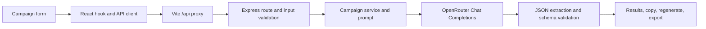

# CampaignAI Studio

CampaignAI Studio is a full-stack application that generates ecommerce campaign copy for email, WhatsApp, and SMS from a single campaign brief. This repository contains the React client, Express API, prompt definitions, validation, tests, and development notes.

## Assignment Coverage

| Assignment requirement | Implementation |
| --- | --- |
| Product name and description | Required campaign form fields |
| Offer, target audience, campaign objective, tone | Required form fields with tone choices and presets |
| Generate copy with an AI model | Express API calls OpenRouter Chat Completions |
| Five email subjects and three preview texts | Generated and schema-validated by the backend |
| Promotional email, WhatsApp, and SMS | Generated and shown in channel-specific result views |
| Copy generated output | Copy controls are available on result sections |
| Relevant, grounded copy and CTA | Prompt rules constrain copy to supplied product facts and request channel-appropriate CTAs |
| Bonus: tones, regeneration, export | Tone selection, per-section regeneration, Markdown and PDF export |
| Source code, setup guide, architecture | Included in this repository and documented below |
| LLM conversation/tool log | See [llm_conversations.md](llm_conversations.md) and [docs/llm-conversations.md](docs/llm-conversations.md) |

AI output quality depends on the selected OpenRouter model. The server validates the required output structure, but generated wording should still be reviewed before use in a real campaign.

## Architecture



- **Client:** React 19, Vite, Tailwind CSS 4, and Lucide icons. `useCampaignGenerator` coordinates form state, loading/errors, generation, and section regeneration. The Vite development server proxies `/api` to the backend at port `5000`.
- **Server:** Node.js and Express. Routes call controllers, validators, and campaign services. The OpenRouter service tries the configured model and then its fallback models. AI responses are parsed and validated before being returned to the client.
- **Persistence:** No database is required. Campaign data is held in the browser during the current session and sent to the API when requested.
- **PDF:** The browser builds a styled HTML campaign brief and converts it to a paginated PDF with `html2pdf.js`/`html2canvas`. PDF content is rendered as page images, not searchable vector text.

## Project Layout

```text
client/       React application, UI components, styles, and API client
server/       Express API, prompts, validators, services, and tests
docs/         Prompt engineering notes
llm_conversations.md
              Development LLM/tool conversation summary
```

## Setup

### Prerequisites

- Node.js 18 or newer and npm
- An OpenRouter API key

### Install dependencies

From the repository root, install each package:

```bash
cd server
npm install
cd ../client
npm install
```

### Configure the server

Copy `server/.env.example` to `server/.env` and set a valid key. On Windows PowerShell:

```powershell
Copy-Item server/.env.example server/.env
```

On macOS, Linux, or Git Bash:

```bash
cp server/.env.example server/.env
```

Set `OPENROUTER_API_KEY` in `server/.env`. The default model is `openrouter/free`; optional settings are `OPENROUTER_MODEL`, `OPENROUTER_BASE_URL`, and `PORT`. Keep `.env` private and never put the API key in client-side code or commit it.

### Run locally

Start the backend in one terminal:

```bash
cd server
npm run dev
```

Start the frontend in a second terminal:

```bash
cd client
npm run dev
```

Open `http://localhost:5173`. The Vite proxy forwards `/api` requests to `http://localhost:5000`. Check backend availability at `http://localhost:5000/health`.

### Verify

Run the backend validation/parser tests:

```bash
cd server
npm test
```

Build the frontend for production:

```bash
cd client
npm run build
```

The current automated tests cover backend input validation and AI-response parsing. They do not make a live request to OpenRouter; verify live generation with a valid local API key.

## Demo Video Script

**Target length: 2–3 minutes.** Use the sample campaign below, keep the browser zoom at 100%, and do not show `.env` files, API keys, or terminal environment output in the recording.

| Time | On screen | Narration |
| --- | --- | --- |
| 0:00–0:12 | Show the CampaignAI form and results workspace. | “This is CampaignAI Studio, a full-stack tool that turns an ecommerce campaign brief into copy for email, WhatsApp, and SMS.” |
| 0:12–0:35 | Enter AirStride Running Shoes, its lightweight/breathable/cushioned description, the offer, audience, objective, and choose Energetic. | “I’ll enter the product facts, offer, target audience, and campaign goal, then choose a tone. These details ground the generated copy.” |
| 0:35–0:55 | Click Generate and show the loading state, then the results. | “The client sends the brief to the Express API, which validates it, builds the prompt, calls OpenRouter, and validates the structured response.” |
| 0:55–1:28 | Scroll through five subjects, three previews, promotional email, WhatsApp, and SMS. | “The result includes the five required email subjects, three preview texts, a complete promotional email, a WhatsApp message, and an SMS.” |
| 1:28–1:48 | Copy one subject or message, then paste it into a blank text editor. | “Each section can be copied independently, so the selected copy is ready to use in a campaign workflow.” |
| 1:48–2:08 | Regenerate one section and show the replacement. | “If one channel needs a different angle, I can regenerate that section without replacing the rest of the campaign.” |
| 2:08–2:28 | Export Markdown and/or PDF; show the exported file. | “The campaign can also be exported as Markdown or as a formatted, paginated PDF brief.” |
| 2:28–2:40 | End on the results view or a short architecture slide. | “CampaignAI combines a React frontend, Express API, and OpenRouter model integration, with input and response validation around generation.” |

Suggested sample values: **Product:** AirStride Running Shoes; **Description:** Lightweight running shoes for everyday runners with breathable mesh, cushioned sole, and anti-slip grip; **Offer:** 20% off plus free shipping; **Audience:** Men and women aged 20–40 looking for comfortable running and walking shoes; **Objective:** Drive purchases during the weekend sale; **Tone:** Energetic.

## Submission Checklist

- [x] Source code is in this repository.
- [x] README includes setup instructions and a brief architecture explanation.
- [x] LLM/prompt development notes are present in Markdown.
- [ ] Publish the repository with the required GitHub access and add its URL to the submission.
- [ ] Record the demo using the script above, upload it, and verify the reviewer can view it.

The last two items require publishing/recording actions outside this code workspace and are not confirmed complete here.
